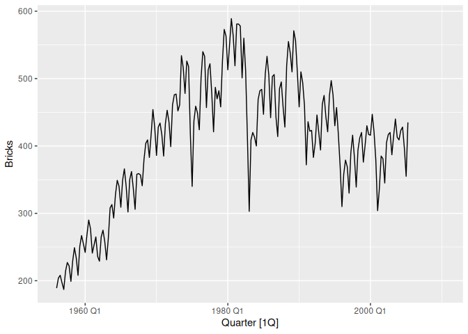
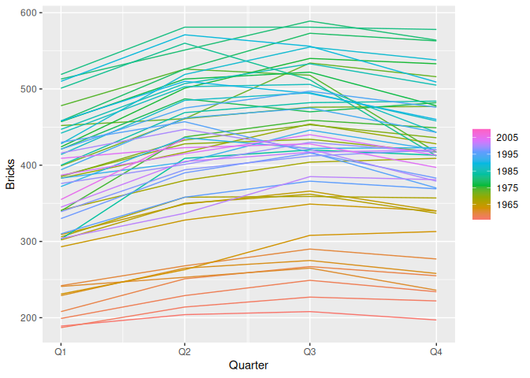
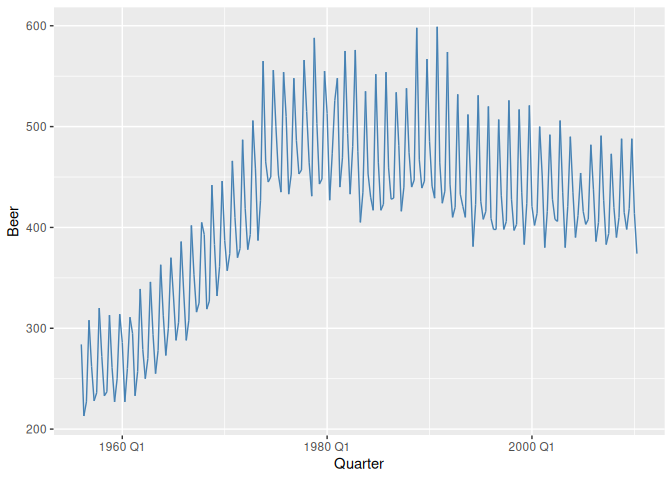
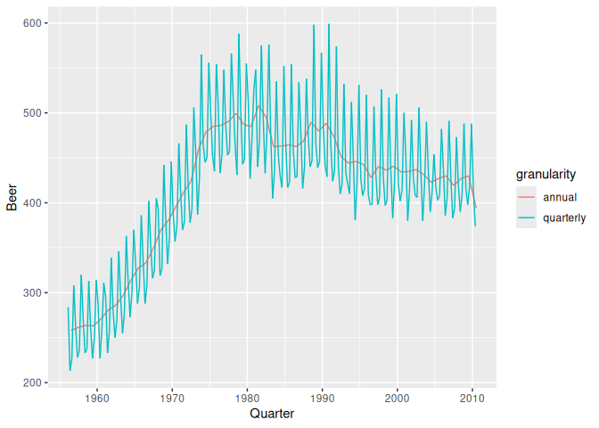
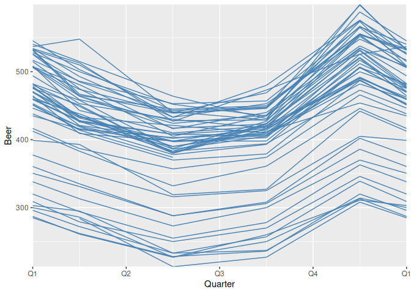
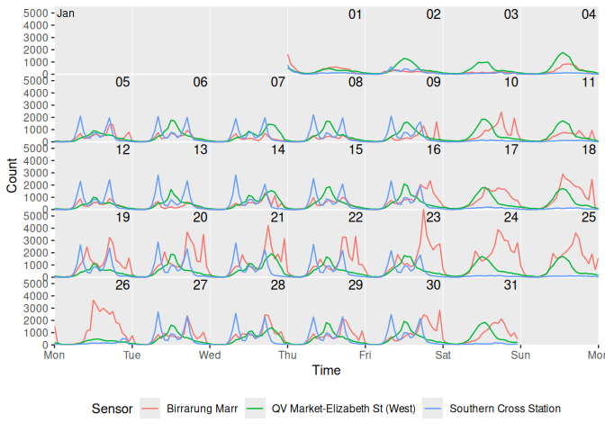

<!-- README.md is generated from README.Rmd. Please edit that file -->

# ggtime <a href="https://pkg.mitchelloharawild.com/ggtime/"></a>

<!-- badges: start -->
[](https://lifecycle.r-lib.org/articles/stages.html#experimental)
[](https://CRAN.R-project.org/package=ggtime)
[](https://github.com/mitchelloharawild/ggtime/actions/workflows/R-CMD-check.yaml)
<!-- badges: end -->

The ggtime package extends the capabilities of ‘ggplot2’ by providing
grammatical elements and plot helpers designed for visualizing time
series patterns. These functions use calendar structures implemented in
the mixtime package to help explore common time series patterns
including trend, seasonality, cycles, and holidays.

The plot helper functions make use of the tsibble data format in order
to quickly and easily produce common time series plots. These plots can
also be constructed with the underlying grammar elements, which allows
greater flexibility in producing custom time series visualisations. The
examples below cover both: plot helpers first, then the grammar elements
they’re built from.

## Installation

You can install the **stable** version from
[CRAN](https://cran.r-project.org/package=ggtime):

``` r
install.packages("ggtime")
```

You can install the development version of ggtime from
[GitHub](https://github.com/) with:

``` r
# install.packages("remotes")
remotes::install_github("mitchelloharawild/ggtime")
```

## Plot helpers

Plot helper functions turn a tsibble into a complete time series graphic
in one call, such as a time plot or a seasonal plot. They’re quick to
use, but only offer as much customisation as their arguments allow.

The simplest time series visualisation is the time plot, which shows
time continuously on the x-axis with the measured variable on the
y-axis. This is useful for identifying patterns that persist over a long
period of time, such as trends and seasonality. `autoplot()` creates a
time plot directly from a tsibble.

``` r
library(ggtime)
library(ggplot2)
library(tsibble)
library(dplyr)

tsibbledata::aus_production |>
  autoplot(Beer)
```



To see the shape of the annual seasonal pattern, it’s more useful to
show time cyclically on the x-axis, making it easier to identify the
peaks, troughs, and overall shape of the seasonality. `gg_season()`
creates this seasonal plot from a tsibble.

``` r
tsibbledata::aus_production |>
  gg_season(Beer)
```



ggtime includes several other plot helpers for exploring and diagnosing
time series. `gg_subseries()` and `gg_lag()` show seasonal changes over
time and relationships with past values; `gg_arma()` and `gg_irf()` plot
characteristic ARMA roots and impulse response functions; and
`gg_tsdisplay()`/`gg_tsresiduals()` combine several of these into a
single ensemble for exploring a series or diagnosing a model’s
residuals. `autoplot()`/`autolayer()` extend beyond tsibbles too,
dispatching on the model output from the fable/feasts ecosystem to plot
forecasts and their prediction intervals (`fbl_ts`), the components of a
decomposition (`dcmp_ts`), and auto-/cross-correlation results
(`tbl_cf`).

## Grammar extensions

For full control over a time series plot’s appearance, ggtime’s grammar
extensions add time-aware geoms, scales, and coordinate systems that
behave like any other ggplot2 component. Use them to combine layers,
apply your own themes and colour scales, and build visualisations the
plot helpers don’t cover.

`geom_time_line()` is a time-aware extension of `ggplot2::geom_line()`
that keeps a line’s slope an accurate reflection of the rate of change,
even across timezone changes, gaps, and duplicated time points.

``` r
tsibbledata::aus_production |>
  ggplot(aes(x = Quarter, y = Beer)) +
  geom_time_line(colour = "steelblue")
```



`scale_x_mixtime()` is the position scale behind every mixtime time
axis, applied automatically whenever a `mixtime` vector is mapped to a
plot. It maps time points of different granularities onto one shared
axis, as shown below with quarterly and annual Beer production drawn
together, and takes calendrical durations for breaks (`time_breaks`) and
calendar-aware format strings for labels (`time_labels`).

``` r
aus_beer <- tsibbledata::aus_production |>
  as_tibble() |>
  transmute(Quarter = mixtime::yearquarter(as.Date(Quarter)), Beer)

aus_beer_annual <- aus_beer |>
  group_by(Quarter = mixtime::year(Quarter)) |>
  summarise(Beer = mean(Beer), .groups = "drop")

bind_rows(
  quarterly = aus_beer,
  annual = aus_beer_annual,
  .id = "granularity"
) |>
  ggplot(aes(Quarter, Beer, colour = granularity)) +
  geom_time_line() +
  scale_x_mixtime(time_breaks = mixtime::years(10L))
```



`coord_loop()` loops the time axis around a calendrical period, so a
continuous time axis can be compared cyclically instead of being
discretised into a seasonal factor. Looping the time plot yearly reveals
the same seasonal shape as the seasonal plot above, built entirely from
grammar.

``` r
aus_beer |>
  ggplot(aes(x = Quarter, y = Beer)) +
  geom_time_line(colour = "steelblue") +
  coord_loop(time_loops = mixtime::years(1L))
```



`coord_calendar()` arranges time into a calendar-like grid of rows and
columns, useful for visualising events over short intervals within a
long time span, such as holidays. Arranging hourly pedestrian counts
into a weekly calendar reveals a surge in activity at one sensor during
the Australian Open in late January.

``` r
tsibble::pedestrian |>
  mutate(Time = mixtime::datetime(Date_Time)) |>
  filter(Time < mixtime::datetime("2015-02-01 00:00:00")) |>
  ggplot(aes(x = Time, y = Count, colour = Sensor)) +
  geom_line() +
  coord_calendar(rows = mixtime::weeks(1L), cols = NULL) +
  theme(legend.position = "bottom")
```


